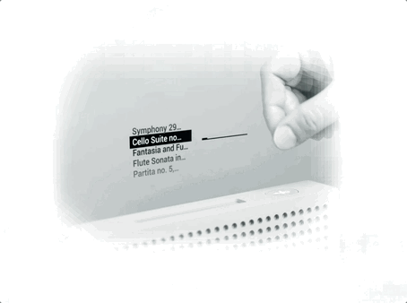
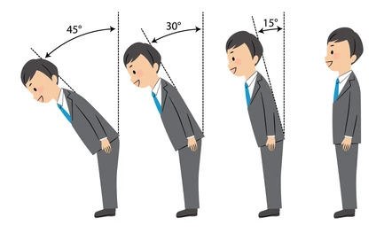
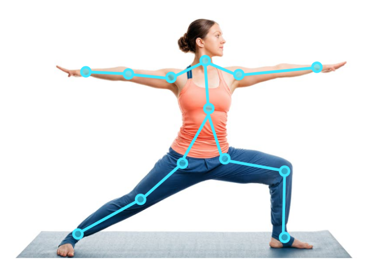

# Week 5 - Pose detection

- Intro Machine Learning. Data > Training > Model.
- Werken met pose detection met pretrained model van mediapipe.
- game of app besturen met poses

   

## MediaPipe

[MediaPipe](https://developers.google.com/mediapipe/solutions/examples) is een library van google, waarin een model is getraind om poses in webcam beelden te herkennen. Je krijgt deze poses terug als vector data (`x,y` coördinaten). 

Je kan een `<canvas>` element gebruiken om de poses over het webcam beeld heen te tekenen.

| Hand | Body | Face |
| ---- | ---- | ---- |
|  |  |  |

   

# Opdracht

## Webpagina

Bouw een html pagina met webcam pose detection van [MediaPipe](https://developers.google.com/mediapipe/solutions/examples). Kies hand, body of face detection. Gebruik de documentatie om de webcam te lezen en de poses in een canvas te tekenen.

|Pose|Demo|Docs|Codepen|
|---|---|---|---|
| ✌️ Hand | [demo]((https://mediapipe-studio.webapps.google.com/demo/hand_landmarker)) | [docs]((https://developers.google.com/mediapipe/solutions/vision/hand_landmarker#get_started)) | [codepen](https://codepen.io/mediapipe-preview/pen/gOKBGPN) |
| 🕺 Body | [demo](https://mediapipe-studio.webapps.google.com/demo/pose_landmarker) | [docs](https://developers.google.com/mediapipe/solutions/vision/pose_landmarker#get_started) | [codepen](https://codepen.io/mediapipe-preview/pen/abRLMxN) |
| 😱 Face | [demo](https://mediapipe-studio.webapps.google.com/demo/face_landmarker) | [docs](https://developers.google.com/mediapipe/solutions/vision/face_landmarker#get_started) | [codepen](https://codepen.io/mediapipe-preview/pen/OJBVQJm) |

 

## Posedata tonen

Omdat je de poses in een canvas tekent, heb je toegang tot de `x,y` pose coördinaten. Toon deze coördinaten in de browser console of in een html veld. Maak een button die de coördinaten alleen toont `on click`, omdat de pagina traag kan worden als je 60 keer per seconde een grote hoeveelheid data logt.

 

## Posedata gebruiken

Bedenk een game of applicatie waarbij je gebruik maakt van de `x,y` coördinaten van de pose. Dit haal je uit de *live posedata*. Lees de documentatie om precies te weten welk getal bij welk lichaamsdeel hoort.

> *Tips: Is er een `z` coördinaat beschikbaar? En kan je aan de afstand tussen beide ogen ook zien hoe ver iemand van de webcam verwijderd is?*

 

|  |  |
|--|--|
|  Fashion site om zonnebrillen uit te proberen|  Afstand tot de laptop gebruiken om te zien of iemand rechtop zit. |
|  Handpositie gebruiken om pong paddles te besturen |  Afstand en beweging gebruiken om squid-game na te bouwen |
|  Volume button zonder fysieke button | Emotie gebruiken om spotify playlist aan te passen | 
|  Handpositie gebruiken als verfkwast | [Gestures gebruiken om drumcomputer te besturen](https://youtube.com/shorts/zQ8Il7xyVQk) | 
|  Bodypose gebruiken om te controleren of je wel beleefd genoeg buigt | Yoga poses oefenen | 

   

## Links

- [MediaPipe Javascript Documentation](https://developers.google.com/mediapipe/api/solutions/js/tasks-vision)
- [MediaPipe Examples](https://developers.google.com/mediapipe/solutions/examples)
- [Codepen Hand](https://codepen.io/mediapipe-preview/pen/gOKBGPN)
- [Codepen Body](https://codepen.io/mediapipe-preview/pen/abRLMxN)
- [Codepen Face](https://codepen.io/mediapipe-preview/pen/OJBVQJm)
- [Hand as computer interface](https://medium.spatialpixel.com/turning-your-hand-into-a-keyboard-6b21d092cfd0)
- [Charlie Gerard pose experiments](https://charliegerard.dev/projects)