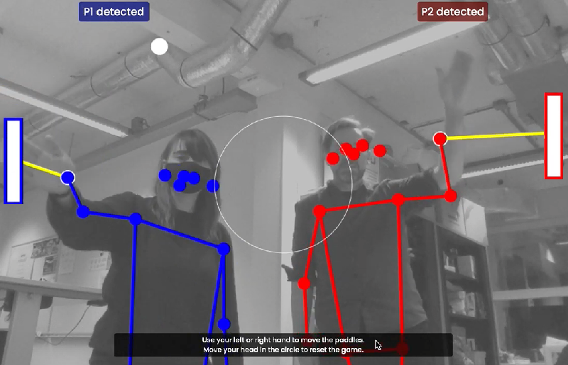

# Week 5 - Pose detection

- Intro Machine Learning. Data > Training > Model.
- Werken met pose detection met pretrained model van mediapipe.
- game of app besturen met poses

<br><br><br>

## MediaPipe

[MediaPipe](https://developers.google.com/mediapipe/solutions/examples) is een library van google, waarin een model is getraind om poses in webcam beelden te herkennen. Je krijgt deze poses terug als vector data (`x,y,z` coördinaten). 

Je kan een `<canvas>` element gebruiken om de poses over het webcam beeld heen te tekenen.

In het geval van [Hand Landmark Detection](https://mediapipe-studio.webapps.google.com/studio/demo/hand_landmarker), [Pose Landmark Detection](https://mediapipe-studio.webapps.google.com/studio/demo/pose_landmarker) en [Face Landmark Detection](https://mediapipe-studio.webapps.google.com/studio/demo/face_landmarker) kun je gebruik maken van de [DrawingUtils](https://developers.google.com/mediapipe/api/solutions/js/tasks-vision.drawingutils) uit de tasks-vision library om te testen of je hand, lichaam of gezicht herkend wordt. Je hoeft dan alleen de landmarks mee te geven en de DrawUtils class zorgt ervoor dat ze meteen op de juiste plek getekend worden.

| Hand | Body | Face |
| ---- | ---- | ---- |
|  |  |  |

<br><br><br>

# Opdracht

## Webpagina

Bouw een html pagina met webcam pose detection van [MediaPipe](https://developers.google.com/mediapipe/solutions/examples). Kies hand, body of face detection. Gebruik de documentatie om de webcam te lezen en de poses in een canvas te tekenen.


|Pose|Demo|Docs|Codepen|
|---|---|---|---|
| ✌️ Hand | [demo](https://mediapipe-studio.webapps.google.com/demo/hand_landmarker) | [docs](https://developers.google.com/mediapipe/solutions/vision/hand_landmarker#get_started) | [codepen](https://codepen.io/mediapipe-preview/pen/gOKBGPN) |
| 🕺 Body | [demo](https://mediapipe-studio.webapps.google.com/demo/pose_landmarker) | [docs](https://developers.google.com/mediapipe/solutions/vision/pose_landmarker#get_started) | [codepen](https://codepen.io/mediapipe-preview/pen/abRLMxN) |
| 😱 Face | [demo](https://mediapipe-studio.webapps.google.com/demo/face_landmarker) | [docs](https://developers.google.com/mediapipe/solutions/vision/face_landmarker#get_started) | [codepen](https://codepen.io/mediapipe-preview/pen/OJBVQJm) |

> *Bekijk ook dit [vereenvoudigd voorbeeld voor het lezen van de webcam](https://codepen.io/eerk/pen/QWPEYxj?editors=0011)*

> *TIP: Als je niet bekend bent met het `<canvas>` element kan je eerst [deze MDN tutorial volgen](https://developer.mozilla.org/en-US/docs/Web/API/Canvas_API/Tutorial)*

<br>

## Posedata in de console

MediaPipe heeft ingebouwd dat je de poses meteen in een canvas kan tekenen. Dit werkt als volgt:

- Start een video stream
- `MediaPipe` detecteert poses in de video en geeft dit terug als `x,y,z` coördinaten.
- `DrawingUtils` tekent de poses over het webcam beeld heen.

Je kan dit goed zien in het [vereenvoudigd voorbeeld voor het lezen van de webcam](https://codepen.io/eerk/pen/QWPEYxj?editors=0011). Toon nu de `x,y,z` coördinaten in de console. In dit voorbeeld worden de `landmarks` van de `body pose` in de console getoond:

### Code voorbeeld bodypose

```js
poseLandmarker.detectForVideo(video, startTimeMs, (result) => {
    // alle gedecteerde personen in de video stream
    console.log(result.landmarks)
    // per body door alle gedecteerde punten loopen
    for (const landmark of result.landmarks) {
        // loggen
        console.log(landmark)
        // tekenen
        drawingUtils.drawLandmarks(landmark, { radius : 2 })
        drawingUtils.drawConnectors(landmark, PoseLandmarker.POSE_CONNECTIONS)
    }
})
```
In deze afbeelding zie je alle punten van de bodypose. Zie ook de documentatie.


<br><br><br>

## Posedata gebruiken

In plaats van de posedata rechtstreeks als punten en lijnen te tekenen met `DrawingUtils` kan je ook zelf de `x,y,z` waarden gebruiken. Kies een van de volgende oefeningen:

- Dezelfde pose vaker tekenen (een kopie van jezelf)
- In het canvas tekenen
- Een HTML element plaatsen

<br><br><br>

## Dezelfde pose vaker tekenen

Je kan spelen met de `drawingUtils` door een kopie van de persoon te maken waarbij de handmatig de `x,y` waarden aanpast. Zie de afbeelding en deze [animatie](https://www.instagram.com/p/C2zBrOcthmI/?img_index=1).


```js
poseLandmarker.detectForVideo(video, startTimeMs, (result) => {
    // DIT IS TEKENING 1
    for (const landmark of result.landmarks) {
        drawingUtils....
    }
    // DIT IS TEKENING 2
    for (const landmark of result.landmarks) {
        drawingUtils....
    }
    // DIT IS TEKENING 3
    for (const landmark of result.landmarks) {
        drawingUtils....
    }
})
```

<br><br><br>

## In het canvas tekenen

Je kan ook handmatig in het canvas element tekenen, dan heb je meer controle over wat je precies wil tekenen. Je kan hier ook kiezen om geen `clearRect()` te doen waardoor al je tekeningen over elkaar heen getekend worden. Je ziet hier een code voorbeeld voor het tekenen van een cirkel in het canvas element.

```js
let canvaselement = document.querySelector("canvas")
let canvasCtx = canvaselement.getContext("2d")
canvasCtx.fillStyle = "red"
canvasCtx.strokeStyle = "blue"
canvasCtx.lineWidth = 4

// teken 1 cirkel
let x = 0.2
let y = 0.5
canvasCtx.clearRect(0, 0, canvasElement.width, canvasElement.height); 
canvasCtx.beginPath()
canvasCtx.arc(canvasElement.width * x, canvasElement.height * y, 4, 0, 2 * Math.PI);
canvasCtx.stroke();
canvasCtx.fill()
```

<br><br><br>

## Een HTML Element plaatsen

Plaats deze zonnebril als IMG element in de HTML pagina. Het doel is dat de zonnebril altijd op de plek van je neus wordt getoond. De coördinaten van je neus kan je vinden met de Face landmarks of body pose landmarks. De positie kan je bepalen met CSS/JS:

```css
.sunglasses {
    position:absolute;
}
```
En vervolgens kan je met javascript de positie bepalen:
```js
let element = document.querySelector(".sunglasses");
let translateX = 50
let translateY = 50
element.style.transform = "translate(" + translateX + "px, " + translateY + "px)";
```

> *🚨 Let op! de landmarks zijn getallen tussen de 0 en 1. De waarde `0,0` betekent linksboven. De waarde `1,1` betekent rechtsonder. Je kan deze waarden vermenigvuldigen met de breedte en hoogte van het video element. Als de neus bv. een `x,y` heeft van `0.2, 0.4` dan is de waarde in pixels `0.2 * videoWidth, 0.4 * videoHeight`.*


<br><br><br>

# Posedata toepassing

Bedenk een game of applicatie waarbij je gebruik maakt van de coördinaten van de pose. Hieronder zie je een aantal voorbeelden. Het doel is dat je leert werken met de coördinaten die het posemodel teruggeeft. Lees de documentatie om precies te weten welk getal bij welk lichaamsdeel hoort.

> *Tip: gebruik de `z` coördinaat om te zien hoe ver weg iets is.*


<br>

|  |  |
|--|--|
| <br>Fashion site om zonnebrillen uit te proberen| <br>Afstand tot de laptop gebruiken om te zien of iemand rechtop zit. |
| <br>Handpositie gebruiken om pong paddles te besturen | <br>Afstand en beweging gebruiken om squid-game na te bouwen |
| <br>Wijsvinger gebruiken als verfkwast, duim als gum |<br>[Gestures gebruiken om drumcomputer te besturen](https://youtube.com/shorts/zQ8Il7xyVQk) | 


<br><br><br>

## Links

- [Canvas Drawing Tutorial](https://developer.mozilla.org/en-US/docs/Web/API/Canvas_API/Tutorial)
- [MediaPipe Guide](https://developers.google.com/mediapipe/solutions/guide)
- [MediaPipe Javascript Documentation](https://developers.google.com/mediapipe/api/solutions/js/tasks-vision)
- [MediaPipe Examples](https://developers.google.com/mediapipe/solutions/examples)
- [Codepen Hand](https://codepen.io/mediapipe-preview/pen/gOKBGPN)
- [Codepen Body](https://codepen.io/mediapipe-preview/pen/abRLMxN)
- [Codepen Face](https://codepen.io/mediapipe-preview/pen/OJBVQJm)
- [Hand as computer interface](https://medium.spatialpixel.com/turning-your-hand-into-a-keyboard-6b21d092cfd0)
- [Charlie Gerard pose experiments](https://charliegerard.dev/projects)
