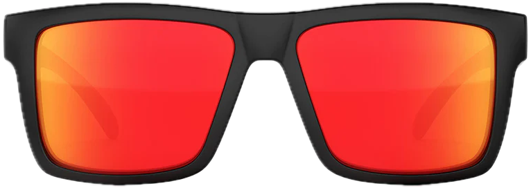

# Week 5 - Pose detection

- Intro Machine Learning. Data > Training > Model.
- Werken met pose detection met pretrained model van mediapipe.
- game of app besturen met poses

   

## MediaPipe

[MediaPipe](https://developers.google.com/mediapipe/solutions/examples) is een library van google, waarin een model is getraind om poses in webcam beelden te herkennen. Je krijgt deze poses terug als vector data (`x,y,z` coördinaten). 

Je kan een `<canvas>` element gebruiken om de poses over het webcam beeld heen te tekenen.

In het geval van [Hand Landmark Detection](https://mediapipe-studio.webapps.google.com/studio/demo/hand_landmarker), [Pose Landmark Detection](https://mediapipe-studio.webapps.google.com/studio/demo/pose_landmarker) en [Face Landmark Detection](https://mediapipe-studio.webapps.google.com/studio/demo/face_landmarker) kun je gebruik maken van de [DrawingUtils](https://developers.google.com/mediapipe/api/solutions/js/tasks-vision.drawingutils) uit de tasks-vision library om te testen of je hand, lichaam of gezicht herkend wordt. Je hoeft dan alleen de landmarks mee te geven en de DrawUtils class zorgt ervoor dat ze meteen op de juiste plek getekend worden.

| Hand | Body | Face |
| ---- | ---- | ---- |
|  |  |  |

   

# Opdracht

## Webpagina

Bouw een html pagina met webcam pose detection van [MediaPipe](https://developers.google.com/mediapipe/solutions/examples). Kies hand, body of face detection. Gebruik de documentatie om de webcam te lezen en de poses in een canvas te tekenen.

|Pose|Demo|Docs|Codepen|
|---|---|---|---|
| ✌️ Hand | [demo](https://mediapipe-studio.webapps.google.com/demo/hand_landmarker) | [docs](https://developers.google.com/mediapipe/solutions/vision/hand_landmarker#get_started) | [codepen](https://codepen.io/mediapipe-preview/pen/gOKBGPN) |
| 🕺 Body | [demo](https://mediapipe-studio.webapps.google.com/demo/pose_landmarker) | [docs](https://developers.google.com/mediapipe/solutions/vision/pose_landmarker#get_started) | [codepen](https://codepen.io/mediapipe-preview/pen/abRLMxN) |
| 😱 Face | [demo](https://mediapipe-studio.webapps.google.com/demo/face_landmarker) | [docs](https://developers.google.com/mediapipe/solutions/vision/face_landmarker#get_started) | [codepen](https://codepen.io/mediapipe-preview/pen/OJBVQJm) |

> *TIP: Als je niet bekend bent met het `<canvas>` element kan je eerst [deze MDN tutorial volgen](https://developer.mozilla.org/en-US/docs/Web/API/Canvas_API/Tutorial)*

 

## Posedata tonen

Omdat je de poses in een canvas tekent, heb je toegang tot de `x,y` pose coördinaten. Toon deze coördinaten in de browser console of in een html veld. 

🚨 Let op! de landmarks zijn getallen tussen de 0 en 1. Je zal deze moeten vermenigvuldigen met de breedte en hoogte van het video element om ze op de juiste plek te krijgen.

Maak een button die de coördinaten alleen toont `on click`, omdat de pagina traag kan worden als je 60 keer per seconde een grote hoeveelheid data logt.

 

## Oefening: zonnebril

Plaats deze zonnebril op de plek van je neus, met de Face landmarks.

 

## Posedata gebruiken

Bedenk een game of applicatie waarbij je gebruik maakt van de coördinaten van de pose. Dit haal je uit de *live posedata*. Lees de documentatie om precies te weten welk getal bij welk lichaamsdeel hoort.

> *Tips: Is er een `z` coördinaat beschikbaar om te zien hoe ver weg iets is? En kan je aan de afstand tussen beide ogen ook zien hoe ver iemand van de webcam verwijderd is?*

 

|  |  |
|--|--|
|  Fashion site om zonnebrillen uit te proberen|  Afstand tot de laptop gebruiken om te zien of iemand rechtop zit. |
|  Handpositie gebruiken om pong paddles te besturen |  Afstand en beweging gebruiken om squid-game na te bouwen |
|  Wijsvinger gebruiken als verfkwast, duim als gum | [Gestures gebruiken om drumcomputer te besturen](https://youtube.com/shorts/zQ8Il7xyVQk) | 

   

## Links

- [Canvas Drawing Tutorial](https://developer.mozilla.org/en-US/docs/Web/API/Canvas_API/Tutorial)
- [MediaPipe Guide](https://developers.google.com/mediapipe/solutions/guide)
- [MediaPipe Javascript Documentation](https://developers.google.com/mediapipe/api/solutions/js/tasks-vision)
- [MediaPipe Examples](https://developers.google.com/mediapipe/solutions/examples)
- [Codepen Hand](https://codepen.io/mediapipe-preview/pen/gOKBGPN)
- [Codepen Body](https://codepen.io/mediapipe-preview/pen/abRLMxN)
- [Codepen Face](https://codepen.io/mediapipe-preview/pen/OJBVQJm)
- [Hand as computer interface](https://medium.spatialpixel.com/turning-your-hand-into-a-keyboard-6b21d092cfd0)
- [Charlie Gerard pose experiments](https://charliegerard.dev/projects)
