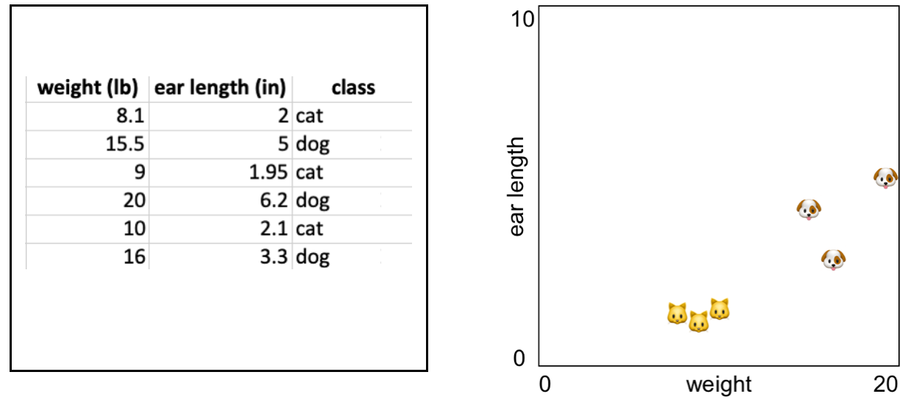

# Week 6

- Herhaling data>training>model. 
- Werken met KNN in javascript
- Data verzamelen uit MediaPipe en opslaan als JSON.
- Data uit MediaPipe voorspellen met KNN

<br><br><br>

## Introductie K-Nearest-Neighbour

Dit algoritme gebruikt afstanden tussen punten om te bepalen waar een punt bij hoort. Je leert de termen *Classification* en *Supervised Learning*.

In dit voorbeeld tekenen we de *weight* en *ear length* van katten en honden in een 2D grafiek als X en Y coördinaten:



Als we een nieuw punt tekenen in de grafiek, kunnen we via de **afstand tot de andere punten** bepalen of het nieuwe punt een kat of een hond is! Dit is wat het KNN algoritme doet. Zie ook dit [interactief voorbeeld op Codepen](https://codepen.io/Qbrid/pen/OwpjLX). 

<br>
<br>
<Br>

## Werken met KNN in Javascript

Installeer het KNN algoritme. 

```sh
npm install knear
```
Maak het algoritme aan in app.js

```javascript
import knn from 'knear'
const k = 3
const machine = new knn.kNear(k)
```

- Als je deze test in de `node` backend doet kan je het makkelijk testen via `node app.js`
- Als je deze test in de frontend/browser doet heb je een module bundler nodig zoals [Vite](https://vitejs.dev/guide/#scaffolding-your-first-vite-project) of [Parcel](https://parceljs.org/getting-started/webapp/)

<br><br><br>

## Classifying

Je gaat het KNN algoritme trainen met gelabelde data. In dit voorbeeld zie je twee datapunten. Vul hier alle data uit onderstaande tabel in! 

```javascript
machine.learn([6, 5, 9], 'cat')
machine.learn([12, 20, 19], 'dog')
```

| Body length | Height | Weight | Ear length |  Label |
| ----------- | ------ | ------ | ---------- |  ----- |
| 18 | 9.2 | 8.1 | 2 | 'cat' |
| 20.1 | 17 | 15.5 | 5 | 'dog' |
| 17 | 9.1 | 9 | 1.95 | 'cat' |
| 23.5 | 20 | 20 | 6.2 | 'dog' |
| 16 | 9.0 | 10 | 2.1 | 'cat' |
| 21 | 16.7 | 16 | 3.3 | 'dog' |

Als je met voldoende data getraind hebt, kan je een `classification` doen.

```javascript
let prediction = machine.classify([12,18,17])
console.log(`I think this is a ${prediction}`)
```
<br>
<br>
<br>

## Werken met MediaPipe data

Het volgende doel is om een handpose, bodypose of facepose uit MediaPipe te classificeren *(bijvoorbeeld het herkennen van "rock" "paper" "scissors" poses)*. Om dit te kunnen doen ga je de volgende stappen zelfstandig doorlopen:

### Pose data verzamelen

Verzamel handpose, bodypose of facepose data uit mediapipe.

Laat de webcam detectie lopen en toon de `x,y,z` coördinaten voor een pose die je wil leren in de console of in een html veld. Kopieer deze coördinaten en voeg er een label aan toe. 

> *🚨 Zorg dat de data uit één enkele array van getallen bestaat. De mediapipe posedata bestaat vaak uit meerdere nested arrays en objecten. Dit moet je vereenvoudigen.*

Let op dat je voor elke pose die je wil leren tientallen voorbeelden nodig hebt. De data sla je op in een javascript array of in een JSON file. Dit zou er als volgt uit kunnen zien:

```js
[
    {pose:[3,34,6,3], label:"rock"}
]
```
### Pose data gebruiken

Nu kan je de posedata aan het KNN algoritme leren op dezelfde manier als bij het *cats and dogs* voorbeeld hierboven.

### Nieuwe poses herkennen

Maak een nieuw project waarin ook weer de MediaPipe pose detection met de webcam draait. Echter, nu ga je de poses proberen te herkennen met je getrainde model!

### Reminder

Bij het werken met AI en Machine learning heb je vaak twee projecten tegelijk open staan:

- Het project waarin je een model aan het trainen bent met gelabelde data.
- Het project waarin je test of je model goed werkt met nieuwe input.


<br>
<br>
<br>

## Links

- [kNear](https://github.com/NathanEpstein/KNear)
- [KNN Codepen Demo](https://codepen.io/Qbrid/pen/OwpjLX) en [uitleg](https://burakkanber.com/blog/machine-learning-in-js-k-nearest-neighbor-part-1/)
- [MediaPipe Examples](https://developers.google.com/mediapipe/solutions/examples)
- [MediaPipe Javascript Documentation](https://developers.google.com/mediapipe/api/solutions/js/tasks-vision)
- [MediaPipe Handpose](https://developers.google.com/mediapipe/api/solutions/js/tasks-vision.handlandmarker#handlandmarker_class)
