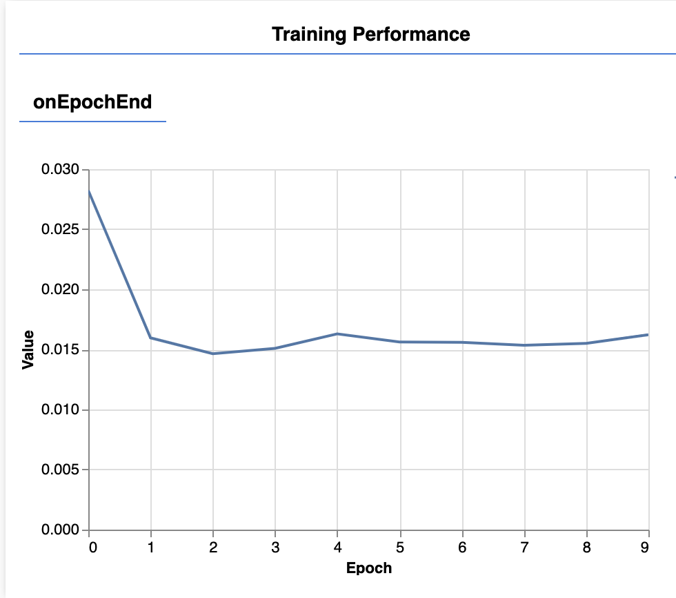

# Week 7

- Werken met Neural Networks in Javascript
- Data, trainen en model opslaan
- Voorspellingen doen
- Troubleshooting

<br><br><br>

## Neural Networks


In week 6 hebben we pose data leren herkennen met het "K-Nearest-Neighbour" algoritme. We gaan nu het "Neural Network" algoritme gebruiken. Een aantal voordelen:

- Het KNN model moet altijd alle data onthouden.
- Een KNN model kan erg groot zijn als er veel data is.
- Het NN model kan juist erg klein zijn, ongeacht hoeveel data er is.
- Een NN is beter in het vinden van complexe of onlogisch lijkende patronen *(een grote dikke kat wordt toch als kat herkend en niet als hond)*
- Een NN kan focussen op de belangrijke onderdelen *(de "claws" van een kat bepalen eigenlijk al dat het een kat is)*

<br>
<br>
<br>

# Neural Network: the basics

Om te oefenen gebruiken we dezelfde cat/dog data als in week 6.

| Body length | Height | Weight | Ear length |  Label |
| ----------- | ------ | ------ | ---------- |  ----- |
| 18 | 9.2 | 8.1 | 2 | 'cat' |
| 20.1 | 17 | 15.5 | 5 | 'dog' |
| 17 | 9.1 | 9 | 1.95 | 'cat' |
| 23.5 | 20 | 20 | 6.2 | 'dog' |
| 16 | 9.0 | 10 | 2.1 | 'cat' |
| 21 | 16.7 | 16 | 3.3 | 'dog' |

We voegen de [ML5](https://learn.ml5js.org/#/reference/neural-network) library toe aan ons project met een `<script>` tag.

```html
<script src="https://unpkg.com/ml5@latest/dist/ml5.min.js"></script>
```
We maken een neural network aan voor classification, en voegen de cat/dog data toe. Vul dit zelf helemaal in.

```js
const nn = ml5.neuralNetwork({ task: 'classification', debug: true })
nn.addData([18,9.2,8.1,2], {label:"cat"})
nn.addData([20.1,17,15.5.5], {label:"dog"})
// vul hier zelf de rest van de data in
// ...
nn.normalizeData()
nn.train({ epochs: 10 }, () => finishedTraining()) 
async function finishedTraining(){    
    const results = await nn.classify([29,11,10,3])
    console.log(results)
}
```

<br>
<br>
<br>

# Werken met posedata

Als bovenstaande testje werkt kan je je `mediapipe posedata` uit les 5 gaan gebruiken om te trainen. Je werkt in drie projecten:

- Project 1: Verzamelen posedata (week 5)
- Project 2: trainen van het model met de posedata (week 6, week 7)
- Project 3: inladen model in de frontend applicatie, live webcam poses voorspellen voor gameplay

Zorg dat je posedata beschikbaar is in je project. Data kan in de vorm van objecten of arrays zijn. Voor een neural network is het belangrijk om je *data te randomizen*. Dat doen we in dit voorbeeld:

```js
data = [
    {pose:[4,2,5,2,1,...], label:"rock"},
    {pose:[3,1,4,4,1,...], label:"rock"},
    {pose:[5,2,5,3,3,...], label:"paper"},
    ...
]
data.sort(() => (Math.random() - 0.5))
```
<br>

### Neural network

Je kan de `data` aan het neural network toevoegen via de `addData` functie.

> 🚨 *Je moet hierbij goed opletten dat het neural network alleen een array van numbers, en een object met een label verwacht! Let op dat de vorm van arrays en objecten correct is, anders gaat het trainen mis.*

#### Input voor neural network
```js
nn.addData([3,5,2,1,4,3,5,2], {label:"rock"})
```

<br><br><br>

## Trainen

Bij het trainen moet je aangeven hoeveel `epochs` dit moet duren. Hier kan je zelf mee experimenteren. De blauwe lijn moet zo dicht mogelijk bij de waarde 0 komen. Als hier geen verbetering meer in zit, heb je genoeg epochs.

```javascript
function startTraining() {
    nn.normalizeData()
    nn.train({ epochs: 10 }, () => finishedTraining()) 
}
async function finishedTraining(){
    console.log("Finished training!")
}
```



<br>
<br>
<br>

## Maak een voorspelling

Met de `classify` functie kunnen we nieuwe data voorspellen. 

```js
async function makePrediction() {
    const results = await nn.classify([...]) // array van numbers
    console.log(results)
}
```

<br>
<br>
<br>

## Model opslaan

Omdat je niet telkens opnieuw een model wil trainen gaan we het opslaan.

```js
nn.save("model", () => console.log("model was saved!"))
```
<br>
<br>
<br>

## Model laden

Dit is je game of applicatie die door de eindgebruiker gebruikt gaat worden. Hierin wordt de live webcam getoond met poses. Je gaat nu ook weer posedata uit de webcam halen. Het doel is nu om te voorspellen welke pose de gebruiker aanneemt, dit doen we met ons getrainde model.

```js
const nn = ml5.neuralNetwork({ task: 'classification', debug: true })
const modelDetails = {
    model: 'model/model.json',
    metadata: 'model/model_meta.json',
    weights: 'model/model.weights.bin'
}
nn.load(modelDetails, () => console.log("het model is geladen!"))
```
Nadat het model is geladen *(let op de callback functie)*, kan je live posedata uit de webcam gaan voorspellen met het neural network. Verzamel data van één live pose, en roep hiermee de `classify()` functie aan.

<br>
<br>
<br>

# Troubleshooting

### Workflow

Bij het werken met Neural Networks heb je vaak meerdere projecten tegelijk open staan:

- Het project waarin je data verzamelt uit de webcam en er een label aan geeft. 
- Het project waarin je een model aan het trainen bent met de gelabelde data. Hier heb je de webcam input niet nodig.
- Het project waarin je test of je model goed werkt met nieuwe input. Dit kan je doen met testdata of met live webcam input. In het eindproduct hoef je niet altijd de pose als lijntjes over het webcam beeld heen te tekenen.

### Asynchrone functies

Een ML5 neural network werkt met *callbacks* en *asynchrone functies*. Dat betekent dat je moet *wachten* totdat een bepaalde taak is afgrond, *voordat* je de volgende taak kan uitvoeren! Bijvoorbeeld:

- Laden van een JSON file met `fetch`
- Trainen van een ML5 Neural Network
- Inladen van een model
- Doen van een voorspelling

> *🚨Een veel voorkomende fout is om te proberen een voorspelling te doen terwijl het trainen nog niet klaar is, of als het model nog niet is ingeladen.*

### Fouten bij trainen

Het trainen van een model kan makkelijk mis gaan. De meest voorkomende oorzaken:

- De data is niet consistent. De inhoud van elk datapunt *(een array met getallen)* moet voor elk datapunt exact hetzelfde zijn. Als één pose uit 100 punten bestaat, dan moeten alle poses uit 100 punten bestaan.
- De labels kloppen niet of je bent labels vergeten.
- Er is iets mis gegaan bij het opslaan van de posedata. Niet elke pose heeft evenveel getallen, of je hebt getallen opgeslagen als strings. (bv. `pose="5,2,5,2"`)
- Je verzamelde data geef je niet in de juiste vorm door aan het algoritme.
- Je data in de classify aanroep heeft een andere vorm dan de data die je bij addData hebt gebruikt.

#### Veel voorkomende fouten

```js
// de pose is hier een object, maar het moet alleen een array met numbers zijn
nn.addData({pose:[2,4,5,3]}, {label:"rock"})

// hier gaat het trainen wel goed, maar bij classify is de data array ineens veel langer
nn.addData([2,3,4], {label:"rock"})
nn.addData([5,3,1], {label:"paper"})
let result = await nn.classify([2,3,4,5,6,7])
```

<br>
<br>
<br>

## Documentatie

- [ML5 AI library voor Javascript](https://learn.ml5js.org/#/)
- [ML5 Neural Networks](https://learn.ml5js.org/#/reference/neural-network)
- [ML5 Neural Networks Hidden Layers](./snippets/layers.md)
- [📺 Crash Course Neural Networks](https://www.youtube.com/watch?v=JBlm4wnjNMY)
- [📺 But what is a neural network?](https://www.youtube.com/watch?v=aircAruvnKk)